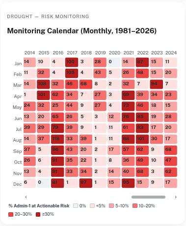
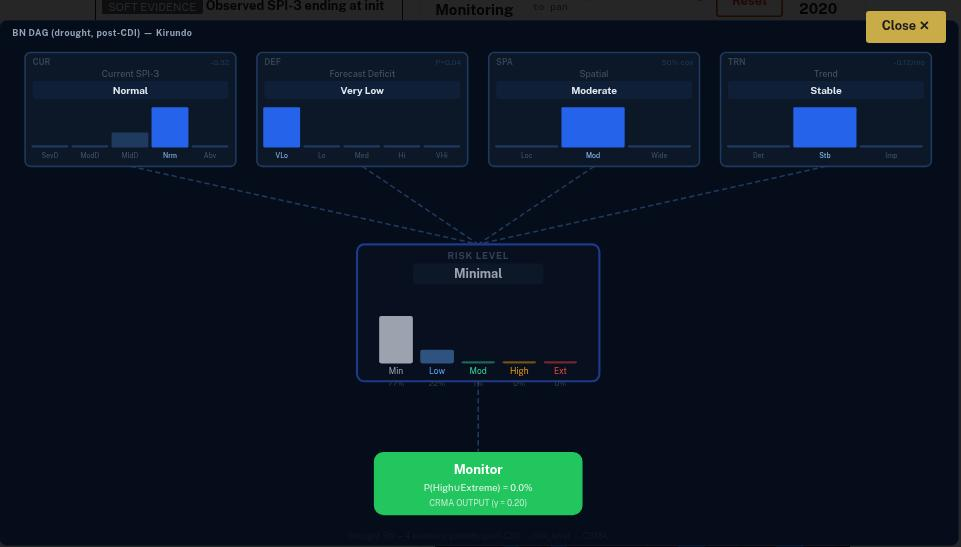
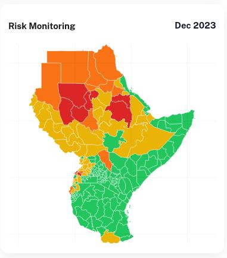

# CRMA — Continuous Risk Monitoring and Assessment
## Scenario Simulation Exercise: "Flight"-simulator for Disaster Operations Centre!

🌐 **CRMA scenario website:** https://crma-frontend-yiyrp6yumq-uc.a.run.app/scenario

🌐 **Presentation Slide:** https://drive.google.com/file/d/1rR5uhCan3snwHgv6A-5ch6IXfw8ey6wj/view?usp=drive_link

Participants relive a real East African **drought or flood** as it unfolded.
Working only with the evidence available **at the time**, they grade each admin-1
region with a risk colour — the call a Disaster Operations Centre (DOC) has to make.

**End outcome:** every admin-1 marked with a **CRMA colour grade**, justified by the
evidence weighed.

> 🟢 **Monitor**  ·  🟡 **Evaluate**  ·  🟠 **Assess**  ·  🔴 **Actionable Risk**

A date **cursor** is stepped through the event window:

- **Flood** — *daily*: last **~7 days observed** rain + next **~7 days forecast**
  (ECMWF ensemble), tested against a **return-period threshold** — the ~15-day
  lead → escalation → onset window.
- **Drought** — *monthly* (**SPI-3**): last **~6 months observed** + the **next
  season** (**MAM / JJA / OND / DJF**) forecast at a **~4–6-month lead** from the
  init month.

---

### Act I — Understanding the Event · *What is happening?*

The monitoring **calendar/timeline** for the event's window is read (daily for
flood, monthly for drought) to build the situational picture.

*Monitoring calendar — monthly for drought (shown), daily for flood; each cell
shaded by the share of admin-1s at Actionable Risk.*

### Act II — Evidence Evaluation & Risk Assessment · *What do we think is happening?*

The evidence is classified and weighed — **hard** (what we measure) · **soft** (what
we estimate) · **virtual** (what we imagine). A **Bayesian Network** combines it into
a hidden **risk grade** (Minimal → Extreme, *expert-rules judgment*) and a **CRMA
decision**.

*Per-admin-1 BN: evidence nodes (Current SPI-3, Forecast Deficit, Spatial, Trend) →
hidden risk-level grade → CRMA decision (here **Monitor / green**, P(High∪Extreme) = 0%, γ = 0.20).*

### Act III — Decision & Reflection · *What should we do, and why?*

Participants commit a **CRMA colour grade** for each admin-1. The recorded **loss &
damage** is then revealed and compared with their call and with the model.

*The end outcome — each admin-1 graded green → red on the available evidence
(Risk Monitoring, Dec 2023).*

---

## Repositories

- **Scenario app & CRMA frontend** — the `arco-ibf` web app used to run this
  exercise: https://github.com/icpac-igad/arco-ibf
- **Drought Bayesian-network analysis** — SPI-3 monthly BN (evidence → risk grade
  → CRMA decision): https://github.com/nishadhka/bn-ibf/tree/jua-bnet/drought_ibf
- **Flood Bayesian-network analysis** — daily BN on the same topology:
  https://github.com/nishadhka/bn-ibf/tree/jua-bnet/flood_ibf
- **EPS data-streaming method** — GRIB-index + Kerchunk for ensemble forecasts:
  https://github.com/icpac-igad/grib-index-kerchunk
- **Storylines & hazard modelling** — event storylines and hazard model DevOps:
  https://github.com/icpac-igad/DevOps-hazard-modeling

## Data sources

Analysis-Ready, Cloud-Optimized (**ARCO**) datasets and streaming formats:

- **Observations** (ERA5 SPI, IMERG …):
  https://source.coop/e4drr-project/observations
- **Forecasts** (SEAS5 SPI-3, ECMWF …):
  https://source.coop/e4drr-project/forecasts
- **ECMWF EPS — GRIB-index Parquet:**
  https://huggingface.co/datasets/E4DRR/gik-ecmwf-par
- **GEFS EPS — GRIB-index Parquet:**
  https://huggingface.co/datasets/E4DRR/gik-gefs-par
- **Flood hazard model output (RIM2D):**
  https://huggingface.co/datasets/E4DRR/rim2d-simulations
- **Drought hazard model output (wflow.jl):**
  https://huggingface.co/datasets/E4DRR/wflow.jl-simulations

---

## Notebooks — open in Google Colab

Per-event **ARCO → Bayesian-Network provenance** notebooks: how each event's
evidence is streamed from the ARCO stores and turned into the BN risk grade.
Open any one directly in Google Colab — no local setup:

- **Kenya — Tana / ASAL drought 2020** — 
- **Burundi drought 2021** — 
- **Eritrea Highlands drought 2021** — 
- **Djibouti drought 2022** — 
- **Kenya — Nairobi flood 2026** — 

---

## Acknowledgements

This work is part of the **E4DRR** project — *hazard modelling, impact estimation,
and climate storylines building an event catalogue of drought and flood disasters
in Eastern Africa*: https://icpac-igad.github.io/e4drr/

Funded by the **United Nations Complex Risk Analytics Fund (CRAF'd)**.

**Data & services** — built on open data from **AWS Open Data**, **ECMWF**,
**NOAA**, the **EC Joint Research Centre (JRC) — Global Drought Observatory**, and
ICPAC's **East Africa Hazard Watch**.

**Open-source software** — powered by free and open-source tools, including
**Icechunk**, **Xarray**, and **Kerchunk**.

